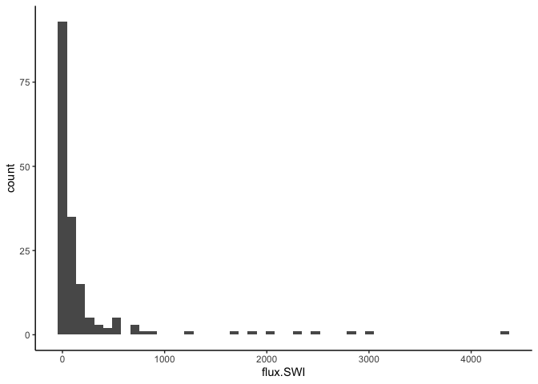

Baltic geochemistry
================

The purpose of this document is to perform a multiple regression in
order to better predict upward fluxes of methane from the sediment-water
interface in the Baltic Sea. Data are compiled, and largely collected,
by Laura Lapham.

Read in the data. Note that I have converted O2 measured by Winkler (in
mL per liter) to match O2 measured by CTD (in mg per liter) using the
conversion factor Laura supplied:

$10\textrm{mL O}_2 = 13.3\textrm{ mg O}_2$

``` r
library(tidyverse)
theme_set(theme_classic())

### Misc global parameters
col.names = c("seq.num", "stn", "flux.SWI", "flux.SMTZ", "SMT.depth.cm",
              "R.swi.smtz", "water.depth.m", "bottom.sal", "bottom.temp", 
              "sed.rate", "POC.rate", "O2.CTD", "O2.Winkler", 
              "lat", "lon", "ref")
flux.label <- expression(paste(CH[4], " flux to SWI, ", mu, "mol", " ", m^2, " ", day^{-1}))

# Read data, combine O2 values from CTD + Winkler, calculate log CH4 flux from SWI
d <- read_csv("data/baltic_geochem.csv",
              col_names = col.names, 
              skip = 1) %>%
  mutate(O2 = case_when(!is.na(O2.CTD) == TRUE ~ O2.CTD,
                        !is.na(O2.Winkler) == TRUE ~ O2.Winkler * 13.3 / 10,
                        TRUE ~ as.numeric(NA))) %>%
  filter(!is.na(flux.SWI)) 

# set zeros to half ot the minimum nonzero value to prevent problems with log values
min.flux.SWI <- min(d$flux.SWI[d$flux.SWI > 0], na.rm=TRUE) / 2 
d <- d %>% 
  mutate(log10.flux.SWI = case_when(flux.SWI==0 ~ log10(min.flux.SWI),
                                    TRUE ~ log10(flux.SWI)))
```

# Mulitvariate model

The data that are present in most samples are:

           seq.num            stn       flux.SWI      flux.SMTZ   SMT.depth.cm 
               172            172            172            155            164 
        R.swi.smtz  water.depth.m     bottom.sal    bottom.temp       sed.rate 
               123            172            164            163             37 
          POC.rate         O2.CTD     O2.Winkler            lat            lon 
               155             48             13            172            172 
               ref             O2 log10.flux.SWI 
               172             59            172 

-   CH4 across SWI
-   SMT depth
-   water depth
-   bottom salinity
-   bottom temp
-   POC accumulation rate

So let’s make a linear model with all of these quantities. This will
take the form of the following equation:


<!--


$$
\textrm{flux}_{\textrm{CH4}\rightarrow{SWI}} = \Beta_1\textrm{SMT depth} + \Beta_2\textrm{water depth} + \Beta_3\textrm{bottom sal} + \Beta_4\textrm{bottom temp} + \Beta_5\textrm{POC accumulation rate} 
$$


-->

``` r
m_naive <- lm(flux.SWI ~ SMT.depth.cm + water.depth.m + bottom.sal + bottom.temp + POC.rate, data = d)
summary(m_naive)
```


    Call:
    lm(formula = flux.SWI ~ SMT.depth.cm + water.depth.m + bottom.sal + 
        bottom.temp + POC.rate, data = d)

    Residuals:
       Min     1Q Median     3Q    Max 
    -525.5 -159.4  -91.0   19.8 3931.8 

    Coefficients:
                   Estimate Std. Error t value Pr(>|t|)   
    (Intercept)   -196.8418   183.9388  -1.070  0.28642   
    SMT.depth.cm    -0.2400     0.1233  -1.946  0.05370 . 
    water.depth.m    1.9114     0.7936   2.409  0.01733 * 
    bottom.sal     -14.9005     8.0136  -1.859  0.06510 . 
    bottom.temp     51.2355    17.3199   2.958  0.00364 **
    POC.rate         3.0048     1.9805   1.517  0.13152   
    ---
    Signif. codes:  0 '***' 0.001 '**' 0.01 '*' 0.05 '.' 0.1 ' ' 1

    Residual standard error: 496.9 on 138 degrees of freedom
      (28 observations deleted due to missingness)
    Multiple R-squared:  0.1383,    Adjusted R-squared:  0.1071 
    F-statistic:  4.43 on 5 and 138 DF,  p-value: 0.0008983

This tells us that there is a significant relationship between CH4 flux
through the SWI and bottom water temperature and water depth, and
marginally SMTZ depth and bottom salinity. The “adjusted R-squared”
(which accounts for the fact that a model with more variables will
always perform better) is only 0.11.

I think what is happening here has to do with the distribution of flux
values:

``` r
ggplot(d, aes(x=flux.SWI)) + 
  geom_histogram()
```

    `stat_bin()` using `bins = 30`. Pick better value with `binwidth`.



There are a few really big values, (18), which I think are driving the
model.

(I’m planning to visualize this, but that’ll have to wait).

A better thing to do would be to take the log of the fluxes, in order to
get a more normal distribution of values. Note that for the zero fluxes,
I adjusted them to half the log_10 of the minimum flux value.

``` r
ggplot(d, aes(x=log10.flux.SWI)) + 
  geom_histogram()
```


This looks much more normally-distributed, although obviously there are
a bunch of low values. I should probably use a [zero-inflated linear
model](https://towardsdatascience.com/zero-inflated-regression-c7dfc656d8af)
but I don’t really know how to do that[^1]

Let’s make the same linear regression, but predicting the log of flux
instead of the actual value.

``` r
m_log_big <- lm(log10.flux.SWI ~ SMT.depth.cm + water.depth.m + bottom.sal + bottom.temp + POC.rate , data = d)
summary(m_log_big)
```


    Call:
    lm(formula = log10.flux.SWI ~ SMT.depth.cm + water.depth.m + 
        bottom.sal + bottom.temp + POC.rate, data = d)

    Residuals:
        Min      1Q  Median      3Q     Max 
    -2.9514 -0.5640  0.1671  0.5124  3.7866 

    Coefficients:
                    Estimate Std. Error t value Pr(>|t|)    
    (Intercept)    0.4837917  0.3782981   1.279 0.203091    
    SMT.depth.cm  -0.0022235  0.0002536  -8.767 6.06e-15 ***
    water.depth.m  0.0047977  0.0016321   2.940 0.003855 ** 
    bottom.sal    -0.0586936  0.0164812  -3.561 0.000507 ***
    bottom.temp    0.1909907  0.0356210   5.362 3.38e-07 ***
    POC.rate       0.0019856  0.0040733   0.487 0.626690    
    ---
    Signif. codes:  0 '***' 0.001 '**' 0.01 '*' 0.05 '.' 0.1 ' ' 1

    Residual standard error: 1.022 on 138 degrees of freedom
      (28 observations deleted due to missingness)
    Multiple R-squared:  0.4599,    Adjusted R-squared:  0.4403 
    F-statistic:  23.5 on 5 and 138 DF,  p-value: < 2.2e-16

Whaddya know, this one actually looks better. SMT depth, water depth,
bottom water salinity, and bottom water temperature are all significant
predictors of log CH4 flux. Adjusted R2 is 0.44, which is a massive
improvement.

Like zero-inflated linear models, I don’t really understand model
selection. Which is great, because it means that I can feel good about
dropping out the non-significant predictor without further
justification.

``` r
m_log_selected <- lm(log10.flux.SWI ~ SMT.depth.cm + water.depth.m + bottom.sal + bottom.temp , data = d)
summary(m_log_selected)
```


    Call:
    lm(formula = log10.flux.SWI ~ SMT.depth.cm + water.depth.m + 
        bottom.sal + bottom.temp, data = d)

    Residuals:
        Min      1Q  Median      3Q     Max 
    -3.0093 -0.5553  0.1450  0.5506  3.8998 

    Coefficients:
                    Estimate Std. Error t value Pr(>|t|)    
    (Intercept)    0.9150632  0.3252852   2.813  0.00557 ** 
    SMT.depth.cm  -0.0022976  0.0002541  -9.043 7.59e-16 ***
    water.depth.m  0.0035719  0.0016186   2.207  0.02886 *  
    bottom.sal    -0.0683742  0.0158285  -4.320 2.84e-05 ***
    bottom.temp    0.1780638  0.0357970   4.974 1.78e-06 ***
    ---
    Signif. codes:  0 '***' 0.001 '**' 0.01 '*' 0.05 '.' 0.1 ' ' 1

    Residual standard error: 1.059 on 149 degrees of freedom
      (18 observations deleted due to missingness)
    Multiple R-squared:  0.4411,    Adjusted R-squared:  0.4261 
    F-statistic:  29.4 on 4 and 149 DF,  p-value: < 2.2e-16

The adjusted R-squared got slightly worse, but it is probably a better
model in the sense that the variable we dropped is the hardest one to
measure.

So, the way to interpret this is that the log-base-10 of methane flux to
the SWI is given by:

log(flux) = 0.915 -0.00230 \* SMT depth (cm) + 0.00357 \* water depth
(m) - 0.06837 \* bottom water salinity + 0.178 \* bottom water temp.

## Visualization

We really shouldn’t rely on a model that we haven’t visualized. However,
visualizing this kind of model is kind of a pain. I know how to do it,
but I need to take a nap, so I’m sending this out without
visualizations. Tune in later!

# Conclusions

As it stands, this model *significantly* predicts CH4 flux through the
sediment-water interface. Significant, in this sense, means that a
random data set would be unlikely to fit the model as well as this data
set does.

However, that is different from a *useful* prediction. Some caveats to
these data:

-   Because of the many zero values in SWI flux, the slopes in this
    model will be a little bit off. I really should go back and use a
    zero-inflated model, but I need to learn to do that.
-   R^2 is like 0.4. That tells us that the model predictions are not
    going to be terribly precise.
-   We’re predicting log methane fluxes. So all the error will get even
    bigger when we convert to methane fluxes.

If you want, I can figure out a way to estamate the error in the methane
flux predictions from the error in the model. But maybe that’s more than
is necessary.

[^1]: It seems that what I want to do is to preface the linear
    regression with a classifier; probably a logistic regression. Not
    sure how to do that but whatevs.
